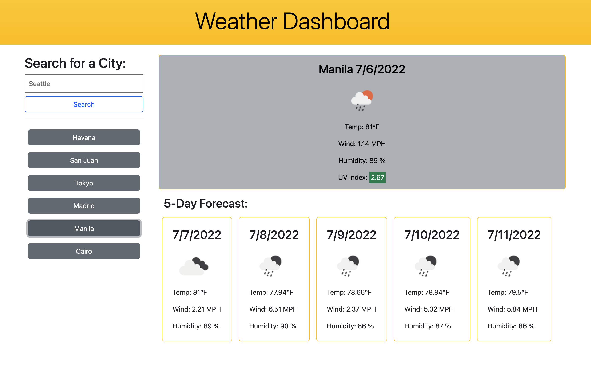

# Weather Dashboard


## Screenshots
Screenshot of the web app:


## Description

It's not easy to find accurate weather forecast, let alone for days in advance. If you're looking to plan a trip or an event and you rely on knowing about the weather beforehand, this web application provides you exactly what you need. Not only can you type absolutely any city, but you'll receive current and up to 5 days from today weather information that includes: temperature, wind speed, humidity, and UV index numbers. Don't know what they mean? An icon representation of the weather for that day is also provided and you can access your past searches and review the weather information for those cities.

## Future Implementations

Future implementations I'd add are:
- Allow the user to specify city and country name to erase confusion
- Background images that match the current weather conditions
- More intuitive and appealing UI
- More accessibility

## Code Snippets

``` javascript
// Get latitude and longitude for city entered
function fetchGeocode() {
    var lat = 0;
    var lon = 0;
    // Clear containers
    dashboard.empty();
    forecastSection.empty();

    // Grab input value if it isn't empty
    if (searchInput.val()) {
        $('.input-error-section').empty();
        cityInput = searchInput.val();
        var apiCall = `https://api.openweathermap.org/geo/1.0/direct?q=${cityInput}&limit=5&appid=${apiKey}`
    
        fetch(apiCall)
        .then(response => {
            if (response.ok) return response.json()
            throw new Error("Response error calling Geocode API");
        })
        .then(data => {
            // To store each input's latitude and longitud coordinates
            lat = data[0].lat;
            lon = data[0].lon;
            fetchAPI(lat, lon, cityInput);
        })
        .catch(error => {
            console.log(error);
        })
    
        // Populate previous searches section
        addToPrevSearch(cityInput);
    
        // Clear search input
        searchInput.val("");
        // Clear array used to store next 5 days in local storage
        prevForecast = [];
    } else {
        var time = 0;

        // Show message to prompt user to type the name of a city
        var interval = setInterval(() => {
            $('.input-error-section').text("Please type in the name of a city");
            time++;

            if (time == 4) {
                clearInterval(interval);
                $('.input-error-section').empty();
            }
        }, 1000);
    }
}
```

Finding the weather information of a city with just a city name was not possible for me to do. My solution was to call OpenWeather's Geocode API with a parameter string of `cityInput` (city name input by the user) and to fetch the latitude and longitude coordinates associated with it. The resolved response included an array of cities with the same name as `cityInput`. Upon retrials, I discovered that the first element of the array was almost always the city the user intended on searching (hense the data[0].lat and data[0].lon). With this data, I could now call OpenWeather's One Call API and get the weather information. If `cityInput` was empty, thought, A message appears right below the submit button, informing the user they must type a valid city name. After 4 seconds, the message disappears. 

## Technologies Used

- HTML
- CSS
- JavaScript
- jQuery
- Bootstrap
- Momentjs
- OpenWeather One Call API
- OpenWeather Geocode API
- OpenWeather 5-Day Forecast API
- Git

## Deployment Link

https://laurasierra17.github.io/weather-dashboard/ 

## User Information
- [LinkedIn](https://www.linkedin.com/in/laurasierra2022)
- [Portfolio](http://www.laura-sierra.com)